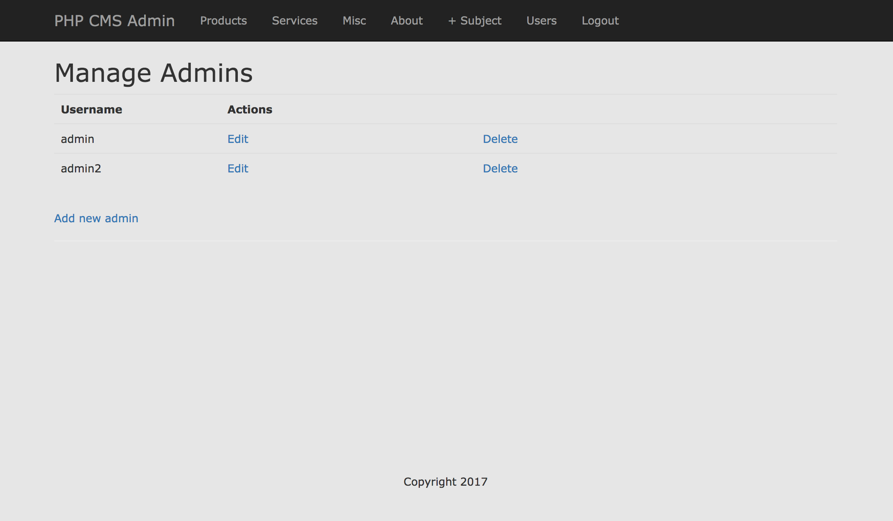

# PHP CMS
A custom CMS system created with PHP and MySQL. Admin users have access to CRUD functionality.


The CMS includes authentication where admins have a different view where they can:
* Manage other admins
* Edit content
* Add content
* Delete content



# Technologies Used
* PHP
* MySQL

## Installation

For setting this up on your local machine to work, you'll need to make sure you have MySQL available. Via the command line, use the following commands:

1) Login

```mysql
mysql -u root -p

```

2) Create your database

```mysql
CREATE DATABASE time_management;
```

3) Make sure the database was properly created

```mysql
SHOW DATABASES;
```

4) Use the created database

```mysql
USE time_management
```

5) For created user, grant all privileges

```mysql
GRANT ALL PRIVILEGES ON time_management.*
TO 'time_cms'@'localhost'
IDENTIFIED BY 'secretpassword';
```

6) Check privileges

```mysql
SHOW GRANTS FOR 'time_cms'@'localhost';
```

7) Log out of MySQL with `exit`, then login with new user

```mysql
mysql -u time_cms -p time_management
```

8) Create subject table

```mysql
CREATE TABLE subjects (
 id INT(11) NOT NULL AUTO_INCREMENT,
 menu_name VARCHAR(30) NOT NULL,
 position INT(3) NOT NULL,
 visible TINYINT(1) NOT NULL,
 PRIMARY KEY (id)
);

```

9) Populate table with placeholder data

```mysql
INSERT INTO subjects (menu_name, position, visible) VALUES ('About', 1, 1);

INSERT INTO subjects (menu_name, position, visible) VALUES ('Products', 2, 1);

INSERT INTO subjects (menu_name, position, visible) VALUES ('Services', 3, 1);

INSERT INTO subjects (menu_name, position, visible) VALUES ('Misc', 4, 0);
```

10) Create pages table

```mysql
CREATE TABLE pages ( id INT(11) NOT NULL AUTO_INCREMENT, subject_id INT(11) NOT NULL, menu_name VARCHAR(30) NOT NULL, position INT(3) NOT NULL, visible TINYINT(1) NOT NULL, content TEXT, PRIMARY KEY (id), INDEX (subject_id) );
```

11) Populate pages with placeholder data

```mysql
INSERT INTO pages (subject_id, menu_name, position, visible, content) VALUES (1, 'Our Mission', 1, 1, 'Our mission has always been...');

INSERT INTO pages (subject_id, menu_name, position, visible, content) VALUES (1, 'Our History', 2, 1, 'Founded a while ago.');

INSERT INTO pages (subject_id, menu_name, position, visible, content) VALUES (2, 'Tools', 1, 1, 'Helpful Tools for your time management.');

INSERT INTO pages (subject_id, menu_name, position, visible, content) VALUES (2, 'Resources', 2, 1, 'Articles to help you with your time management.');

INSERT INTO pages (subject_id, menu_name, position, visible, content) VALUES (3, 'Work Life Balance', 1, 1, 'Finding a work life balance is essential.');

INSERT INTO pages (subject_id, menu_name, position, visible, content) VALUES (3, 'Becoming More Productive', 2, 1, 'Help you find methods to keep you more motivated and productive.');
```

12) To view added data

```mysql
SELECT * FROM pages
```

13) Create admin table

```mysql
CREATE TABLE admins (
 id INT(11) NOT NULL AUTO_INCREMENT,
 username VARCHAR(50) NOT NULL,
 hashed_password VARCHAR(60) NOT NULL,
 PRIMARY KEY (id)
);
```
